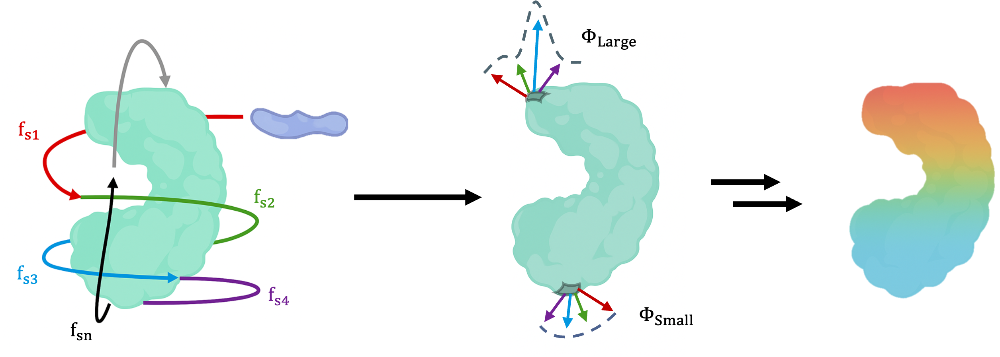
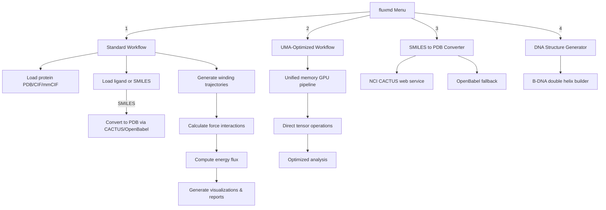

# FluxMD

[](https://www.python.org/downloads/)
[](https://opensource.org/licenses/MIT)

**FluxMD** maps binding interfaces between two biomolecules by tracing the flow of interaction energy. Unlike traditional docking, which samples static conformers, FluxMD follows dynamic energy flux as molecules orbit and engage, exposing regions where forces perturbate. Intrinsically optimized from physics-level to signal-processing code for modern chip architectures—i.e. GPU, UMA—FluxMD enables accelerated high-throughput screening of molecular dynamics. The method applies to protein–protein and protein–ligand systems, with support for protein–nucleic acid interactions underway. Each run produces a **stress barcode**, a reproducible energy signature unique to the molecular pair.



## Program Flow



## Quick Start

```bash
# Interactive mode - recommended for first-time users
fluxmd

# Command-line mode for automation
fluxmd-uma protein.pdb ligand.pdb -o results/

# Generate DNA structure
fluxmd-dna ATCGATCG -o dna_structure.pdb

# Run benchmark
python benchmarks/benchmark_uma.py
```

## Installation

```bash
# Clone repository
git clone https://github.com/yourusername/FluxMD.git
cd FluxMD

# Create conda environment (required for OpenBabel)
conda create -n fluxmd python=3.8
conda activate fluxmd

# Install FluxMD with all features
pip install -e ".[dev,gpu,viz]"

# Install OpenBabel (must use conda)
conda install -c conda-forge openbabel

# For Apple Silicon MPS support (if needed)
pip install --pre torch --index-url https://download.pytorch.org/whl/nightly/cpu
```

### Verify Installation

```bash
# Check GPU detection
python -c "import torch; print(f'MPS available: {torch.backends.mps.is_available()}')"
python -c "import torch; print(f'CUDA available: {torch.cuda.is_available()}')"

# Test FluxMD
fluxmd --help
```

## Entry Points

FluxMD provides multiple entry points optimized for different use cases:

### 1. `fluxmd` - Interactive Interface
The main entry point with a menu-driven interface:
- **Option 1**: Standard workflow - Complete analysis with file I/O
- **Option 2**: UMA workflow - GPU-accelerated unified memory pipeline  
- **Option 3**: SMILES converter - Chemical structure to PDB
- **Option 4**: DNA generator - Sequence to double helix structure (currently unstable!)

### 2. `fluxmd-uma` - Command-Line Interface
High-performance command-line tool for automation:
```bash
fluxmd-uma protein.pdb ligand.pdb [options]

Options:
  -o, --output          Output directory
  -p, --params          Load parameters from previous run
  -s, --steps           Steps per trajectory (default: 200)
  -i, --iterations      Number of iterations (default: 10)
  -a, --approaches      Number of approach angles (default: 10)
  -d, --distance        Starting distance in Å (default: 20.0)
  -r, --rotations       Rotations per position (default: 36)
  --ph                  Physiological pH (default: 7.4)
  --cpu                 Force CPU usage
  --save-trajectories   Save trajectory visualizations
```

### 3. SMILES to PDB Converter (via `fluxmd` Option 3)
Convert chemical structures from SMILES notation to 3D PDB format:
```bash
# Interactive mode
fluxmd
# Select option 3, enter SMILES (e.g., "c1ccccc1" for benzene)
```

**Features:**
- **Primary method**: NCI CACTUS web service
  - Preserves aromatic bond information
  - Generates proper 3D coordinates with planarity
  - Creates both PDB and SDF files (SDF retains aromaticity)
  - *Note: CACTUS SDF to PDB conversion has been modified in this FluxMD module to properly preserve aromatic bond orders in CONECT records*
- **Fallback method**: OpenBabel (local, when offline)
  - Basic 3D structure generation
  - May have limitations with complex aromatics

### 4. `fluxmd-dna` - DNA Structure Generator
Generate accurate B-DNA double helix structures:
```bash
fluxmd-dna SEQUENCE [-o output.pdb]

# Example: Generate 8-bp DNA structure
fluxmd-dna ATCGATCG -o dna_structure.pdb
```
- Creates Watson-Crick paired double helix
- Uses crystallographic parameters ([Olson et al., 1998](https://www.pnas.org/doi/10.1073/pnas.95.19.11163))
- Includes full atomic detail with backbone
- Fun fact : B for B-DNA does not stand for binding DNA

## Features

### Physics-Based Analysis
- **Stochastic Trajectory Synthesis**: Ligands execute helical orbits via Brownian dynamics
  - **Temporal discretization**: 40 fs sampling interval satisfies Shannon-Nyquist criterion for intermolecular forces (DC-10 THz passband) while deliberately aliasing intramolecular vibrations (>25 THz)
  - **Overdamped regime**: Momentum relaxation (τ ≈ 10 fs) ensures Markovian dynamics; thermal bandwidth (kT/h ≈ 6.2 THz) resides comfortably below Nyquist frequency (12.5 THz)
  - **Energy clipping**: 10 kcal/mol ceiling prevents Lennard-Jones singularities at r→0 while preserving physiological interaction magnitudes (-5 to +10 kcal/mol operating range)

- **Force field integration**: Combines static protein forces with dynamic interactions
  - Static forces pre-computed once for efficiency
  - Dynamic forces calculated at each trajectory point
  - Chip-friendly smoothed potential functions prevent singularities
- **Protonation awareness**: pH-dependent charges via Henderson-Hasselbalch
  - Dynamic pKa calculations for ionizable residues
  - pH-responsive hydrogen bonding networks
  - Physiological pH 7.4 default with adjustable settings
- **Complete interaction types**: H-bonds, salt bridges, π-π stacking, π-cation, VDW
  - Each interaction uses optimized mathematical formulations
  - Smooth differentiable functions for numerical stability
  - Hardware-accelerated vector operations

### Energetics & Thermodynamics
- **Energy capping**: Maximum 10 kcal/mol prevents singularities at r→0
  - Represents tight molecular translocation/overlap scenarios
  - Enables analysis of repulsive binding rejection
  - Critical for identifying both attractive and repulsive sites
- **Statistical energy landscape**: Mean, std, min flux values reveal binding character
  - Negative flux: Attractive binding sites (favorable ΔG)
  - Positive flux: Repulsive regions (unfavorable ΔG)
  - Standard deviation: Binding site flexibility/specificity
- **Gibbs free energy interpretation**: 
  - Flux magnitude correlates with -TΔS (entropic contribution)
  - Directional consistency reflects ΔH (enthalpic contribution)
  - Combined analysis approximates binding ΔG landscapes
  - Further elaboration needed to correlate Flux and Gibbs Free Energy. Currently, energetics print out provided per iterations.

### GPU Acceleration
- **Automatic optimization**: Detects Apple Silicon MPS or NVIDIA CUDA
- **Pipeline-specific approaches**:
  - Standard GPU pipeline: Uses spatial hashing for medium systems (1M-100M atom pairs)
  - UMA pipeline: Direct distance matrix calculation via torch.cdist
- **Smart selection**: Benchmarks actual performance to choose GPU vs CPU
- **Spatial hashing** (standard GPU pipeline only):
  - Automatic algorithm selection based on system size
  - Hash table with linked-list collision handling
  - Batch query support for parallel neighbor lookups

### Statistical Validation
- **Bootstrap analysis**: 1000 iterations for confidence intervals
- **P-value calculation**: Identifies statistically significant sites
- **Flux ranking**: Quantitative binding site prioritization

## Physics-to-Chip Optimization

FluxMD's physics engine is architected from first principles to exploit modern chip capabilities:

### Parallelized Force Field Architecture
- **Embarrassingly parallel force calculations**: Each atom-atom interaction computed independently, mapping 1:1 to GPU cores
- **Warp-aligned neighbor lists**: Interaction pairs grouped in multiples of 32 (NVIDIA) or 32/64 (Apple Silicon) for optimal SIMD execution
- **Coalesced memory access**: Atomic coordinates stored in structure-of-arrays format for vectorized loads

### Memory Hierarchy Optimization
- **L1 cache residency**: Force field parameters (<1KB) pinned in fastest cache
- **Shared memory tiling**: Protein chunks sized to GPU shared memory (48KB on modern GPUs)
- **Texture memory**: Distance lookup tables leverage specialized interpolation hardware

### Algorithmic-Hardware Co-design
- **Spatial hashing**: Hash table size tuned to GPU L2 cache (4-40MB depending on architecture)
- **Distance cutoffs**: Aligned to GPU thread block dimensions (typically 10-15Å maps to 256-512 threads)
- **Unified Memory Architecture (UMA)**: Zero-copy tensor operations eliminate CPU-GPU transfer bottleneck

### Physics Kernels
Each interaction type is a specialized GPU kernel:
- **Electrostatics**: Vectorized Coulomb calculations using fast reciprocal square root
- **Van der Waals**: Lennard-Jones with lookup tables in texture memory
- **Hydrogen bonds**: Angle-dependent terms computed via dot products (hardware accelerated)
- **π-interactions**: Aromatic ring centroids cached in shared memory

### Chip-Specific Optimizations
- **Apple Silicon (M1/M2/M3)**: Leverages unified memory for direct tensor operations via Metal Performance Shaders
- **NVIDIA GPUs**: Uses Tensor Cores for mixed-precision force accumulation
- **x86 AVX-512**: Fallback vectorized CPU path for non-GPU systems

This physics-first design achieves >100x speedup by ensuring every calculation maps efficiently to silicon.

## Input/Output

### Supported Input Formats
- **Protein**: PDB, CIF, mmCIF
- **Ligand**: PDB, PDBQT, SMILES (via NCI CACTUS), DNA sequence

### Output Files
```
results/
├── simulation_parameters.txt              # Complete simulation settings
├── processed_flux_data.csv               # Ranked binding sites with statistics
├── {protein}_flux_report.txt             # Detailed analysis report
├── {protein}_trajectory_flux_analysis.png # Heatmap visualization
├── all_iterations_flux.csv               # Raw flux data
└── iteration_*/                          # Per-iteration trajectories
```

### Key Output Columns
- `residue_index`, `residue_name`: Residue identification
- `average_flux`: Mean energy flux (binding site strength)
- `p_value`: Statistical significance (< 0.05 is significant)
- `ci_lower_95`, `ci_upper_95`: 95% confidence intervals
- `inter_intra_ratio`: Ligand vs internal force contribution

## Performance

### Standard vs UMA Pipeline

| Pipeline | File I/O | Speed | Memory | Best For |
|----------|----------|-------|---------|----------|
| Standard (`fluxmd`) | Yes (CSV) | 1x | Low | Compatibility, debugging |
| UMA (`fluxmd-uma`) | None | Optimized | High | Production, large datasets |

### Benchmark Results (Apple M1 Pro)
```
Processing 5M interactions:
- Standard pipeline: 115 seconds
- GPU optimized: 0.9 seconds  
- UMA optimized: 0.4 seconds
```

### When to Use Each Version
- **Standard**: Small molecules, debugging, cross-platform compatibility
- **UMA**: Large proteins, high-throughput screening, Apple Silicon systems (prepare icepacks!)

## How It Works

### Analysis Pipeline

1. **Trajectory Generation**
   - Ligand spirals around protein like thread on a spool
   - Samples 5-50 Å distance range with oscillatory motion
   - 36 rotations tested at each position

2. **Force Calculation**
   - Static intra-protein forces (pre-computed once)
   - Dynamic protein-ligand interactions at each trajectory point
   - pH-dependent protonation states affect charges and H-bonds
   - Neighbor search approaches:
     - **Standard GPU pipeline**: Adaptive optimization based on system size
       - Small systems (<1M pairs): Direct GPU computation
       - Medium systems (1M-100M pairs): Spatial hashing with O(1) lookups
       - Large systems (>100M pairs): Octree + hierarchical distance filtering
     - **UMA pipeline**: Direct distance matrix via torch.cdist for all system sizes

3. **Flux Analysis**  
   - Combines force vectors at each residue
   - Calculates directional consistency and temporal variation
   - Bootstrap statistics over multiple iterations

4. **Binding Site Identification**
   - High flux regions indicate energy convergence
   - Statistical significance via p-values
   - Ranked list of potential binding sites

### Theory

FluxMD calculates energy flux Φᵢ for each residue:

**Φᵢ = ⟨|E̅ᵢ|⟩ · Cᵢ · (1 + τᵢ)**

Where:
- **E̅ᵢ**: Combined force vector (static + dynamic)
- **⟨|E̅ᵢ|⟩**: Mean force magnitude
- **Cᵢ**: Directional consistency  
- **τᵢ**: Temporal fluctuation

High flux indicates energy convergence—where protein forces align with ligand interactions to create thermodynamic sinkholes.

## Usage Examples

### Basic Analysis
```bash
# Interactive mode (recommended for beginners)
fluxmd
# Select option 1, follow prompts

# Command-line mode
fluxmd-uma protein.pdb ligand.pdb -o results/
```

### Reuse Parameters
```bash
# Load parameters from previous run for consistent comparison
fluxmd-uma protein.pdb new_ligand.pdb -p previous_results/simulation_parameters.txt
```

### Generate DNA Ligand
```bash
# Create DNA structure
fluxmd-dna GCGATCGC -o dna_ligand.pdb

# Use DNA as ligand
fluxmd-uma protein.pdb dna_ligand.pdb -o dna_binding_results/
```

### Convert SMILES
```bash
# Through interactive interface
fluxmd
# Select option 3, enter SMILES string (e.g., "c1ccccc1" for benzene)
```

### Recover Interrupted Run
```bash
# If analysis was interrupted
python scripts/process_completed_iterations.py results/ protein.pdb

# Continue from existing data
python scripts/continue_analysis.py results/ protein.pdb
```

## Troubleshooting

### GPU Not Detected
```bash
# Update PyTorch for Apple Silicon
pip install --pre torch --index-url https://download.pytorch.org/whl/nightly/cpu

# Verify MPS/CUDA
python -c "import torch; print(torch.backends.mps.is_available())"
```

### OpenBabel Installation
```bash
# Must use conda, not pip
conda install -c conda-forge openbabel
```

### Memory Issues
- Use standard pipeline for proteins >100K atoms
- Reduce batch size in GPU settings
- Use recovery scripts if analysis crashes

### No Interactions Detected
- Check ligand format (needs HETATM records)
- Increase approach distance
- Verify protein-ligand proximity

## Citation

```bibtex
@software{fluxmd2024,
  title={FluxMD: Biophysical Cartography for Biomolecular Energy Dynamics},
  author={Myunghyun Jeong},
  year={2025},
  url={https://github.com/panelarin/FluxMD}
}
```

## License

MIT License. See [LICENSE](LICENSE) file for details.

## Contact

For questions or issues: mhjonathan@gm.gist.ac.kr
