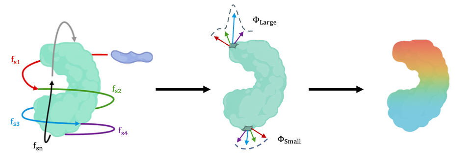

# FluxMD 2.0

[](https://www.python.org/downloads/)
[](https://opensource.org/licenses/MIT)
[](https://github.com/myunghyunj/FluxMD-simulation)

**FluxMD v2.0** introduces the **Matryoshka Engine**, a high-performance, physics-based trajectory generator for mapping biomolecular binding interfaces. Unlike traditional docking or linear-path sampling, the Matryoshka engine simulates a ligand's Brownian motion across nested layers of the protein's solvent-excluded surface (SES), providing a more realistic exploration of the binding landscape.

This major release is intrinsically optimized for modern chip architectures—including GPU and Unified Memory Architecture (UMA)—enabling accelerated, high-throughput screening of molecular dynamics. It applies to protein–protein, protein–ligand, and protein–nucleic acid systems.



## Program Flow (v2.0)


## Quick Start

```bash
# Run the new Matryoshka analysis (recommended)
fluxmd

# Or run non-interactively via config file
fluxmd --config matryoshka_config.yaml
```

## Key Features in 2.0

- **Matryoshka Trajectory Engine**: Physics-based Brownian dynamics on nested solvent-excluded surfaces.
- **Enhanced Performance**: Retains the UMA-optimized core for GPU-accelerated energy calculations.
- **Advanced Physics**: Implements BAOAB Langevin integrator for correct statistical mechanics, Stokes-Einstein diffusion, and quaternion-based rotational dynamics.
- **Streamlined UI**: The main menu is reordered to prioritize the new Matryoshka workflow, with legacy methods moved to a submenu.

## Installation

Installation requirements remain the same. See `pyproject.toml` for details.

```bash
# Clone repository
git clone https://github.com/myunghyunj/FluxMD-simulation
cd FluxMD-simulation

# Create conda environment (recommended)
conda create -n fluxmd2 python=3.8
conda activate fluxmd2

# Install FluxMD with all features
pip install -e ".[dev,gpu,viz]"
```

## Legacy Workflows

The original "cocoon" and "UMA cocoon" workflows from FluxMD 1.x are still available under the "Legacy Workflows" menu option. They are suitable for reproducing older results but are no longer under active development.

## Entry Points

FluxMD provides multiple entry points optimized for different use cases:

### 1. `fluxmd` - Interactive Interface
The main entry point with a menu-driven interface:
- **Option 1**: Matryoshka workflow (Default)
- **Option 2**: SMILES converter - Chemical structure to PDB
- **Option 3**: DNA generator - Sequence to double helix structure
- **Option 4**: Protein-DNA UMA analysis
- **Option 5**: Legacy workflows (Standard cocoon and UMA cocoon, deprecated)
- **Option 6**: Exit

### 2. `fluxmd-uma` - Command-Line Interface
High-performance command-line tool for automation:
```bash
fluxmd-uma protein.pdb ligand.pdb [options]

Options:
  -o, --output          Output directory
  -p, --params          Load parameters from previous run
  -s, --steps           Steps per trajectory (default: 200)
  -i, --iterations      Number of iterations (default: 10)
  -a, --approaches      Number of approach angles (default: 10)
  -d, --distance        Starting distance in Å (default: 20.0)
  -r, --rotations       Rotations per position (default: 36)
  --ph                  Physiological pH (default: 7.4)
  --cpu                 Force CPU usage
  --save-trajectories   Save trajectory visualizations
```

### 3. SMILES to PDB Converter (via `fluxmd` Option 3)
- **Primary**: NCI CACTUS web service (tuned to preserve aromaticity)
- **Fallback**: OpenBabel (local, basic 3D generation)

### 4. `fluxmd-dna` - DNA Structure Generator
```bash
fluxmd-dna ATCGATCG -o dna_structure.pdb
```
- B-DNA double helix with accurate geometry ([Olson et al., 1998](https://www.pnas.org/doi/10.1073/pnas.95.19.11163))
- Complete atomic detail including sugar-phosphate backbone
- CONECT records for all covalent bonds

## Technical Implementation

### Physics Foundation
- **Trajectory Synthesis**: Helical orbits via Brownian dynamics with 40 fs temporal discretization
- **Energy Function**: Rosetta REF15 with all major terms (fa_atr, fa_rep, fa_sol, fa_elec, hbond)
- **Energy Bounds**: ±10 kcal/mol cap prevents singularities while preserving physiological range
- **pH Awareness**: Henderson-Hasselbalch for dynamic protonation states (default pH 7.4)

### Computational Architecture
- **GPU Acceleration**: Automatic detection of Apple MPS or NVIDIA CUDA
- **Memory Optimization**: 
  - Force field parameters in L1 cache
  - Protein chunks sized to GPU shared memory
  - Zero-copy operations on UMA systems
- **Adaptive Algorithms**:
  - Direct computation (<1M atom pairs)
  - Spatial hashing (1M-100M pairs)
  - Hierarchical filtering (>100M pairs)

### REF15 Energy Details
- **Atom Typing**: 167 Rosetta atom types with automatic PDB mapping
- **Energy Terms**:
  - Lennard-Jones (fa_atr/fa_rep): 6Å/4.5Å cutoffs with switching functions
  - Solvation (fa_sol): Lazaridis-Karplus implicit solvent model
  - Electrostatics (fa_elec): Distance-dependent dielectric (ε = 10r)
  - H-bonds (hbond): Orientation-dependent scoring
- **Intelligent Sampling**: Surface property analysis guides trajectory generation
- **Energy Modes**: `simplified` (fast), `ref15` (default), `ref15_fast` (GPU-optimized)

### Statistical Framework
- **Bootstrap Analysis**: 1000 iterations for confidence intervals
- **Significance Testing**: P-values for binding site identification
- **Signed Flux Metric**: Φᵢ = ⟨E̅ᵢ⟩ · Cᵢ · (1 + τᵢ)
  - E̅ᵢ: Energy-weighted vector (preserves sign)
  - Cᵢ: Directional consistency (coherence)
  - τᵢ: Temporal variation (normalized variance)

## Input/Output

### Supported Input Formats
- **Protein**: PDB, CIF, mmCIF
- **Ligand**: PDB, PDBQT, SMILES (via NCI CACTUS), DNA sequence

### Output Files
```
results/
├── simulation_parameters.txt              # Complete simulation settings
├── processed_flux_data.csv               # Ranked binding sites with statistics
├── {protein}_flux_report.txt             # Detailed analysis report
├── {protein}_trajectory_flux_analysis.png # Heatmap visualization
├── all_iterations_flux.csv               # Raw flux data
└── iteration_*/                          # Per-iteration trajectories
```

### Key Output Columns
- `residue_index`, `residue_name`: Residue identification
- `average_flux`: Mean energy flux (binding site strength)
- `p_value`: Statistical significance (< 0.05 is significant)
- `ci_lower_95`, `ci_upper_95`: 95% confidence intervals
- `inter_intra_ratio`: Ligand vs internal force contribution

## Performance

| Pipeline | File I/O | Memory | Best For |
|----------|----------|---------|----------|
| Standard (`fluxmd`) | CSV files | Lower | Debugging, compatibility |
| UMA (`fluxmd-uma`) | In-memory | Higher | Production, large systems |

- **Standard**: Cross-platform compatibility, easier debugging
- **UMA**: Optimized for unified memory architectures (Apple Silicon)

## How It Works

1. **Trajectory Generation**: Ligand spirals around protein (5-50 Å range, 36 rotations/position)
2. **Force Calculation**: REF15 energy function computes static (intra-protein) and dynamic (protein-ligand) forces
3. **Flux Analysis**: Combines forces to calculate flux metric Φᵢ = ⟨|E̅ᵢ|⟩ · Cᵢ · (1 + τᵢ)
4. **Statistical Validation**: Bootstrap analysis identifies significant binding sites (p < 0.05)

High flux indicates energy convergence where forces align to create favorable binding environments.

## Usage Examples

### Basic Analysis
```bash
# Interactive mode (recommended for beginners)
fluxmd
# Select option 1, follow prompts

# Command-line mode
fluxmd-uma protein.pdb ligand.pdb -o results/
```

### Reuse Parameters
```bash
# Load parameters from previous run for consistent comparison
fluxmd-uma protein.pdb new_ligand.pdb -p previous_results/simulation_parameters.txt
```

### Generate DNA Ligand
```bash
# Create DNA structure
fluxmd-dna GCGATCGC -o dna_ligand.pdb

# Use DNA as ligand
fluxmd-uma protein.pdb dna_ligand.pdb -o dna_binding_results/
```

### Convert SMILES
```bash
# Through interactive interface
fluxmd
# Select option 3, enter SMILES string (e.g., "c1ccccc1" for benzene)
```

### Recover Interrupted Run
```bash
# If analysis was interrupted
python scripts/process_completed_iterations.py results/ protein.pdb

# Continue from existing data
python scripts/continue_analysis.py results/ protein.pdb
```

## Troubleshooting

### GPU Not Detected
```bash
# Update PyTorch for Apple Silicon
pip install --pre torch --index-url https://download.pytorch.org/whl/nightly/cpu

# Verify MPS/CUDA
python -c "import torch; print(torch.backends.mps.is_available())"
```

### OpenBabel Installation
```bash
# Must use conda, not pip
conda install -c conda-forge openbabel
```

### Memory Issues
- Use standard pipeline for proteins >100K atoms
- Reduce batch size in GPU settings
- Use recovery scripts if analysis crashes
- Not recommended to run more than two runs of DNA-protein simulations (unless memory > 128 GB)

### No Interactions Detected
- Check ligand format (needs HETATM records)
- Increase approach distance
- Verify protein-ligand proximity

## Citation (Archive)

```bibtex
@software{fluxmd2025,
  title={Stress Barcoding Proteins]{FluxMD: High-Throughput Protein Stress Barcoding for Dynamic Structural Analysis},
  author={Myunghyun J. Jeong},
  year={2025},
  url={TBD}
}
```

## License

MIT License. See [LICENSE](LICENSE) file for details.

## Contact

For questions or issues: mhjonathan@gm.gist.ac.kr

## Acknowledgement

Engineered on top of my previous 2023 term project: [Protein Folding Analysis Bioinformatics](https://github.com/jaehee831/protein-folding-analysis-bioinformatics).

**Note**: `generate_linear_cocoon_trajectory` has been removed; use `generate_uniform_linear_trajectory`.
